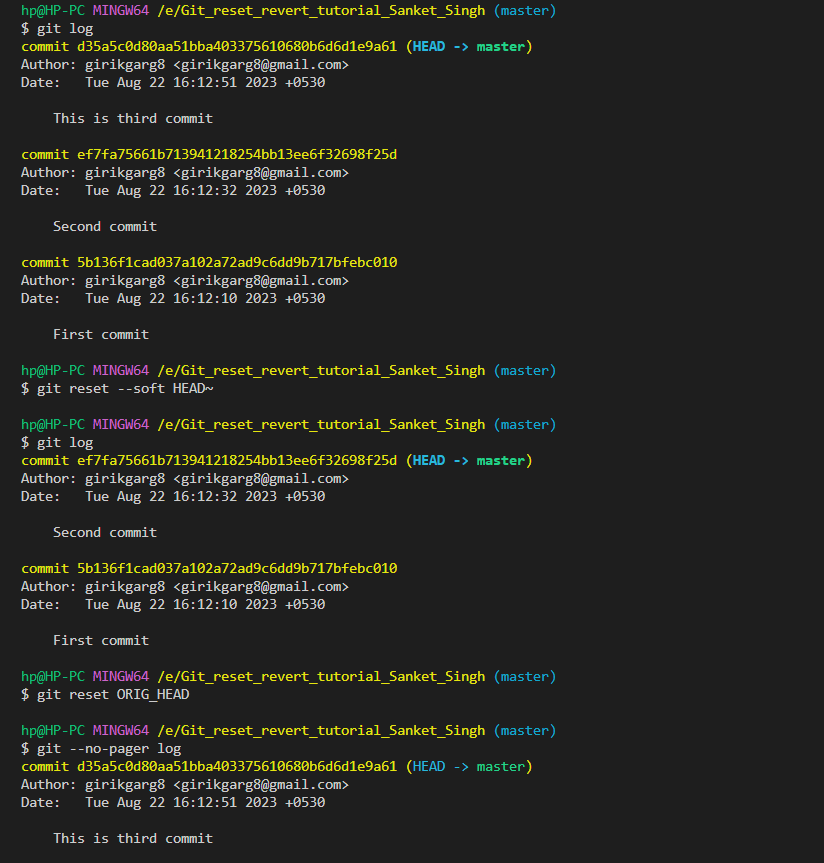
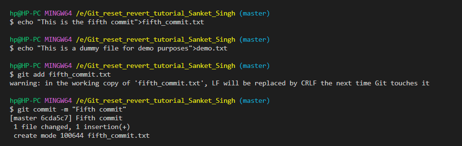
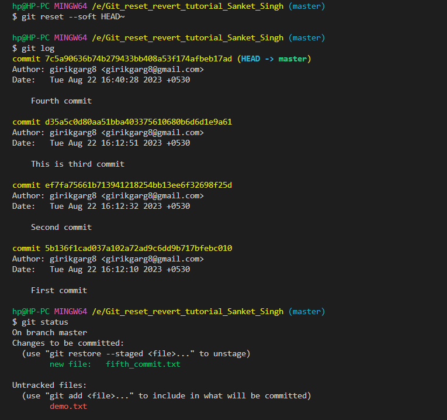
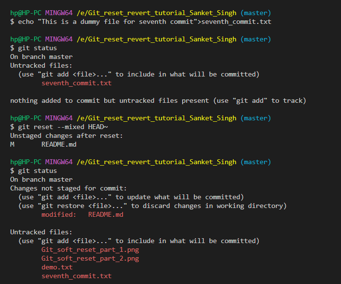

## Undoing changes in git

If we made some errors during creating the commits, and we want to undo the commits, we have several options available with us like `git checkout`, `git reset` and `git revert`. Let's explore them:

1. `git checkout <commit ID>`: Already discussed in detail, in earlier tutorials. Using this command, moves the HEAD pointer to the specified commit (resulting in an detached HEAD state), but doesn't move the branch pointer.

2. `git reset`: The primary difference between `git checkout` and `git reset` is that the `git reset` command moves the branch pointer to the specified commit (and consequently, the HEAD pointer too). `git reset` comes with three options `--soft, --hard and --mixed`. The `--soft` option is considered to be safe, `--hard and --mixed` options should be used with caution.

Let's understand these options:

1. `--soft option`: This option is used to reset the branch pointer (let's suppose master for the purpose of discussion) to the specified commit. The changes in the staging area and the working area from the current commit are not cleared, that's why it's considered to be safe. 

An important question that comes up, is that how do we go back to the original commit: let's say we reset to commit 3 from commit 4, is there a way we can make the master branch point to commit 4 again? 

There are two ways to do this:

1. Using `tag` for commit 4 before using the `git reset` command, so that we have a reference to the commit using the tag.

2. Using `git reset ORIG_HEAD`. The ORIG_HEAD is a backup reference to the HEAD before a drastic change is made to the HEAD pointer. In other words, we can also say that the ORIG_HEAD points to the branch before the `git reset` option is executed.

Unrelated but a useful piece of information: Using the `git --no-pager log ` command can be used to disable the pager while viewing the commit history.



The changes in the staging area and working area are preserved when using soft reset, the committed files from the new commit are moved to staging area:




2. `--mixed option`: This is the default option for using git reset. In this mode, the changes from the staging area of the current commit are erased, and the staging area instead has the changes from the commit where we reset the branch pointer to. To make the point more clear, let's consider the picture below:

The files in the staging area from the current commit's working area are un-staged and moved to the working area.



3.  `--hard option`: The changes from the commits, the staging area and the working directory all are lost when doing a hard Git reset.

The bible to clear all the doubts, with suitable examples:  [Atlassian ](https://www.atlassian.com/git/tutorials/undoing-changes/git-reset#:~:text=Git%20reset%20operates%20on%20%22The,be%20passed%20to%20git%20reset%20.)
Answer from Stack Overflow which clarifies the concept even further: 

```
I find it best to understand them by breaking down files into three categories: unstaged, staged, commit:

--hard should be easy to understand, it restores everything

--mixed (default) :
unstaged files: don't change
staged files: move to unstaged
commit files: move to unstaged

--soft:
unstaged files: don't change
staged files: dont' change
commit files: move to staged
```

There's one way to still gain control if we lose our changes accidentally: using the `git reflog` command. Reference logs, or "reflogs", record when the tips of branches and other references were updated in the local repository. However, reflogs come with a limitation that they are stored for 90 days, by default. 

1:09:25

===> A safer way to undo 